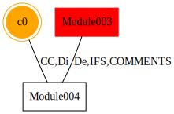

### Module Metric Distance:
#### Overview 
The contents of this repository contain the implementation of an algorithm known as the Module Metric Distance algorithm. This algorithm has been under development at BSU as part of ongoing research at Ball State University. The research in question focuses on software metrics and their use for improving software development by providing insight into large systems and pinpointing brittle or error prone code. The current research thrust of the BSU research team focuses on using metric based automated static analysis to detect vulnerabilities.

Note: A number of details have been obscured intentionally. This project is part of ongoing research and a final project for a Verification and Validation course at Ball State University. 

The MMD algorithm operates by taking an input format file and header file. The header file is used to interpret the format file. The data file contains the data that the algorithm will process. For every row in a data file (representing a module), all XMLTAG and METRIC type elements are compared with the corresponding type in every other row. Differences are recorded and some number of nearest neigbor modules are maintained. These neigbors could differ by 1 metric, 2, or 20. As long as the metric difference is the least metric difference for a module it will qualify as the nearest neigbor. After analysis has been carried out on a data file, graphs are generated for each of the modules and their nearest neigbors. In the graphs that are produced, each node represents a module or metric clone, and each edge a nearest metric difference relationship. In addition, an information rich XML format prints a second representation of the nearest metric relationships within the modules of the data file.  


##### e.g. Given the following inputs...
<table border="0">
 <tr><th>example.dma_fmt</th><th>example.dma</th></tr>
 <tr>
    <td>
        NAME<br>  
        METRIC CC<br>  
        METRIC IFS<br>  
        METRIC Di<br>  
        METRIC De<br>  
        METRIC COMMENTS<br>  
        VULNERABILITY<br>  
        CWE  
        CATEGORY  
    </td>
    <td>
        Module001 10 2 8 9 1 0 22 HASH<br>
        Module002 10 2 8 9 1 1 66 SQLI<br>
        Module003 0 1 3 8 0 1 89 XSS<br>
        Module004 0 2 3 9 1 0 89 XSS<br>
    </td>
 </tr>
</table>
A graph will be rendered using graphviz which looks like:  

</img>

and an XML file which looks like:
```
<?xml version="1.0" encoding="UTF-8" standalone="no"?>
<!DOCTYPE mmd SYSTEM "roles.dtd">
<mmd>
    <filename>example_input.dma</filename>
    <clone_group>
        <clone_data>
            <clone_group_process_data>
                <clone_group_vulnerablility_status>MIXED</clone_group_vulnerablility_status>
                <clone_group_vulnerablility_category>MIXED</clone_group_vulnerablility_category>
            </clone_group_process_data>
            <clone_group_id>c0</clone_group_id>
            <count_of_clone_group>2</count_of_clone_group>
        </clone_data>
        <clone_module>
            <module_id>
                <name>Module001</name>
            </module_id>
            <module_process_data>
                <cwe>22</cwe>
                <vulnerability>0</vulnerability>
                <category>HASH</category>
            </module_process_data>
        </clone_module>
        .
        .
        .
        <distance_connections>
            <connection_id>e0</connection_id>
        </distance_connections>
    </clone_group>
    <module>
        <module_id>
            <name>Module003</name>
        </module_id>
        <process_data>
            <cwe>89</cwe>
            <vulnerability>1</vulnerability>
            <category>XSS</category>
        </process_data>
        <distance_connections>
            <connection_id>e1</connection_id>
        </distance_connections>
    </module>
    .
    .
    .
    <connection>
        <connection_id>e1</connection_id>
        <list_of_metrics>
            <metric>
                <metric_name>De</metric_name>
                <value module="m2">9</value>
                <value module="m3">8</value>
            </metric>
            <metric>
                <metric_name>IFS</metric_name>
                <value module="m2">2</value>
                <value module="m3">1</value>
            </metric>
            <metric>
                <metric_name>COMMENTS</metric_name>
                <value module="m2">1</value>
                <value module="m3">0</value>
            </metric>
        </list_of_metrics>
    </connection>
</mmd>
```

#### Testing:
This project has been tested using black box and white box approaches. Black box tests were used to verify that the project met the requirements as they were specified. Black box tests can be found in ./test/. White box tests were developed using JUnit and can be found in ./src/test/java/mmd/. These tests verified the methods found within the MMD source code, and are useful for regression testing when new features are added.